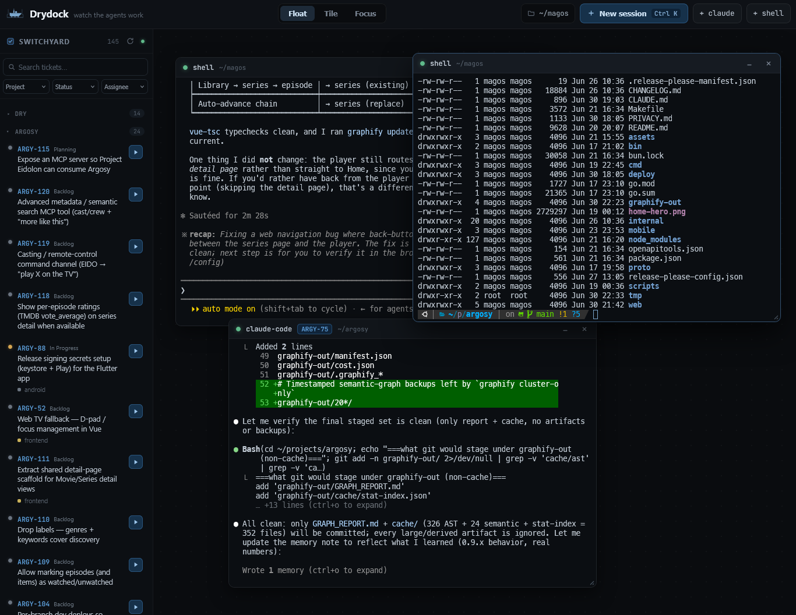

#  Drydock



A per-host **daemon that owns AI-CLI PTYs** (`claude`, `gemini-cli`, plain shells)
plus a **Vue 3 + xterm.js web shell** that attaches to them. The daemon — not any
client — holds the PTY master for the whole life of the child process, so sessions
survive disconnects, sleep, and multi-day gaps. The browser is just a viewer.

> PoC for [IDEA-3]. Scope here is the **thin magic slice**: durable PTY sessions,
> a multi-pane xterm grid, and the `PreToolUse` hook-based in-place approval loop —
> enough to decide whether this beats just using warp/tmux.

## Architecture

```
┌───────────────────────────┐        WebSocket (attach/detach, replay)
│  shell/  (Vue 3 + xterm)  │◀───────────────────────────────────────┐
│  multi-pane grid, viewer  │        HTTP (session list / spawn)     │
└───────────────────────────┘                                        │
                                                                     ▼
                                       ┌────────────────────────────────────────┐
                                       │  daemon/  (Node + node-pty + ws)       │
   claude PreToolUse hook ─ HTTP ─────▶│  • owns PTY master per session         │
   (curl → /hook/pretooluse)           │  • ring-buffer scrollback + replay     │
   claude SessionStart hook ─ HTTP ───▶│  • holds approval gates open for a UI  │
   (curl → /hook/sessionstart)         │  • injects ticket body as context      │
   claude Stop hook ─ HTTP ───────────▶│  • resolves ticket repo → spawn cwd    │
   (curl → /hook/stop)                 │  • per-ticket git worktree isolation   │
                                       │  • marks idle ("Your turn") on Stop    │
                                       │  • one per host; unauthenticated       │
                                       └────────────────────────────────────────┘
                                                        │ spawns  claude --settings <hooks>
                                                        ▼  (PTY in the ticket's worktree/cwd,
                                                           DRYDOCK_SESSION_ID in env)
                                              claude / gemini-cli / shell
```

The wrapped CLI owns its own auth — Drydock never touches API keys. The
subscription-billed CLI *is* the access model; that's why we wrap it.

## Why a daemon (not ssh + tmux)

Durability is table stakes — a tmux *server* already owns the PTY independent of
client attach/detach. The point of building our own is the layer on top: an
always-visible multi-agent grid and **hook-based in-place approval** — a pane
lights up when its agent hits a permission gate and you approve in the UI, the
decision pre-empting the CLI's own prompt. That's the part nothing else gives you.

## Backend language decision (IDEA-4)

**TypeScript** for the daemon, **Bun** as package manager / task runner, with the
daemon process on **Node** (node-pty's V8 dependency — see caveat above). Trade-off:

| | Go | TypeScript (chosen) |
|---|---|---|
| PTY/process control | strong; ConPTY direct | `node-pty` wraps ConPTY + Unix |
| Distribution | single static binary | Node runtime (or `bun build --compile` for the non-PTY parts) |
| Shared types w/ Vue shell | no | **yes** (one protocol type) |
| Time-to-PoC | slower | **fastest vertical slice** |

For the PoC, time-to-slice and shared types win. Bun gives fast installs and runs
the shell; the daemon runs on Node because node-pty needs V8's C++ API. If Drydock
graduates, revisit Go — its single-binary-per-host story is genuinely cleaner here
than a Node + native-addon deploy, so the daemon is the most likely thing to port.

## Run it

Two terminals for dev. For a stable prod instance (systemd daemon on `:4318` +
nginx shell container on `:5321`, immune to dev's `--watch` restarts) see
[docs/deploy.md](docs/deploy.md). [Bun](https://bun.sh) is the
package manager + task runner; `bun install` also compiles the `node-pty` addon
(via `scripts/build-native.mjs`). Agents and contributors: [CLAUDE.md](CLAUDE.md)
has the build caveats, the second-instance verification pattern, and the tracker
smoke-test checklist — read it before touching `daemon/src/`.

```bash
bun install            # installs both workspaces + builds node-pty

bun run daemon         # → :4317  (runs on Node, see below; binds 0.0.0.0 — LAN/Tailscale)
bun run daemon:local   # same, locked to 127.0.0.1
bun run shell          # → http://0.0.0.0:5320  (runs on Bun; binds LAN by default)
```

The daemon API is **unauthenticated** (PoC posture): anyone who can reach the
port can spawn and attach to shells as you. Keep it on `127.0.0.1` or a trusted
LAN/Tailscale; real auth is the first thing to add past PoC.

### Bun + node-pty caveat (why the daemon runs on Node)

The daemon process runs on **Node**, not Bun: `node-pty`'s native addon uses the
**V8 C++ API** (`v8::Value::ToString`), which Bun's JavaScriptCore runtime doesn't
provide — it loads but segfaults on the first PTY spawn. Two consequences baked
into the scripts:

- The `bun run daemon` script invokes `node` explicitly (`node --import tsx ...`).
  Bun honors an explicit `node` and routes to the real Node binary, so the command
  still works — it just doesn't run the daemon *on* Bun.
- `node-pty` must be compiled by **Node's** node-gyp. Bun's own install-time build
  (and `bun x node-gyp`) compiles against Bun and produces a binary that crashes.
  The `postinstall` runs `node scripts/build-native.mjs` to build it correctly.

Everything else — dependency install, the Vue shell, task orchestration — is pure
Bun. If `node-pty` ever ships a clean N-API build (no V8 C++ API), the daemon can
move onto Bun too.

Open <http://127.0.0.1:5320>, set a working dir, and spawn a `claude` or `bash`
session. To exercise the approval loop, ask the agent to run a shell command
(e.g. *"run `ls -la` for me"*): the `Bash` tool trips the `PreToolUse` hook, the
daemon holds the call open, the pane's border turns red, and you Approve / Deny
in the UI — the decision pre-empting Claude's own prompt. The hooks are injected
into every spawned session (`claude --settings`), so any working dir works with
no per-repo setup.

## The workspace

- **Windowed multi-pane desktop.** Every session is a window: drag/resize freely
  in Float mode, or let Tile/Focus manage the rects
  (`composables/useWindowManager.ts`). Minimizing sends a still-running session
  to a macOS-style **dock** — the daemon owns the PTY, so a hidden pane costs
  nothing; a pending approval keeps the dock dot pulsing so a gated session
  can't get lost.
- **Composite ticket workspace (DRY-21).** Spawning from a ticket opens one
  window binding the ticket and two independent PTYs — the agent on top, a
  co-located `zsh` below — with a pull-down ticket drawer that overlays the
  panes instead of resizing them. Split ratio and collapse state persist.
- **Live tracker sidebar (DRY-11/17).** Open tickets from the active tracker,
  grouped by repo, with search, project/status/assignee filters, and collapsible
  groups. Picking one opens the ticket detail as a floating, raiseable window
  (DRY-20) — read the description, adjust cwd/worktree/prompt, then spawn.
- **`Ctrl K` quick-launch.** Fuzzy-search tickets by key/title/repo; `↵` spawns
  an agent on the selection, or a blank `claude` session when nothing matches.
- **In-place approval loop.** A `PreToolUse` gate lights the pane (border turns
  red) and Approve/Deny in the UI pre-empts the CLI's own prompt. Ticket spawns
  default to the **Auto** toggle (DRY-22), starting the agent in hands-off
  permission mode; the daemon honors hands-off modes (`bypassPermissions` /
  `auto` / `dontAsk`) by auto-allowing instead of popping a gate that Claude
  Code would ignore anyway (DRY-5).
- **"Your turn" indicator (DRY-18).** The injected `Stop` hook flags a session
  idle when the agent yields; the window badge and dock light up. A turn ending
  means "done *or* waiting on your reply" — the UI never claims "complete".
- **Layout persistence (DRY-14).** Window positions, sizes, dock state, z-order,
  and layout mode persist per daemon host across reloads
  (`composables/layoutStore.ts`).

## Layout

- `daemon/` — PTY-owning backend. `session.ts` is the core (PTY ownership,
  scrollback, approval gates); `manager.ts` is the session registry;
  `server.ts` is the HTTP + WS surface; `repos.ts` resolves a ticket's repo
  name to its real working directory on this host; `worktree.ts` creates and
  prunes the per-ticket agent worktrees; `tracker/` holds the provider
  abstraction (fixture / Switchyard / Jira behind one interface).
- `shell/` — Vue 3 viewer. `components/TerminalPane.vue` is the core pane
  (xterm + approval overlay); `WindowFrame.vue` + `composables/useWindowManager.ts`
  do the windowing; `WorkspacePane.vue` is the composite ticket workspace;
  `TicketDetail.vue` is the read-then-spawn panel; `TrackerSidebar.vue`,
  `QuickLaunch.vue` (Ctrl K), and `Dock.vue` round out the chrome.
- `daemon/src/hooks.ts` — the `PreToolUse` + `Stop` + `SessionStart` hooks the
  daemon injects into every spawned `claude` via `--settings` (no per-repo
  install). `daemon/src/protocol.ts` is the wire protocol, duplicated verbatim
  in `shell/src/lib/protocol.ts` — keep them in sync.
- `hooks/` — the same hook config as a standalone snippet (reference / manual
  fallback only; the daemon injects it automatically).
- `deploy/` + [docs/deploy.md](docs/deploy.md) — prod: systemd user unit for
  the daemon, GHCR nginx image for the shell (DRY-19).
- `CLAUDE.md` — agent/contributor onboarding: caveats, verification patterns,
  tracker smoke-test checklist.

## Ticket-driven sessions

Picking a ticket (sidebar or `Ctrl K`) opens its description; the panel shows
the resolved **working directory** (editable — projects with no repo default to
`$HOME`, which you can override). **Send to agent** spawns `claude` there and the
ticket body rides into the agent's context via a `SessionStart` hook (`curl →
/hook/sessionstart`) — not typed into the prompt. The prompt is pre-filled with
your instruction and left for you to send (no auto-submit). The hooks are
injected by the daemon (`claude --settings`), so they work regardless of cwd —
no per-repo `.claude/settings.json` needed.

Repo→directory mapping is host config on the daemon: `DRYDOCK_REPOS_ROOT`
(default `~/projects`, so repo `argosy` → `~/projects/argosy`) with per-repo
overrides via `DRYDOCK_REPO_PATHS="construct-server=~/construct-server,imperium-loop=~/imperium-loop"`.
A name that resolves to no existing directory falls back to `$HOME`.

**Worktree isolation (DRY-15).** When that repo is a git work tree, the agent
doesn't run in your checkout — it gets its own **git worktree** on branch
`agent/<TICKET>` under `~/.drydock/worktrees/<repo>-<TICKET>` (configurable via
`DRYDOCK_WORKTREES_ROOT`; set `DRYDOCK_WORKTREES=0` to disable). So two agents on
the same repo never clobber each other's working tree. The panel previews the
worktree/branch and lets you edit or opt out before spawning. Worktrees are
**kept when you close the session** — the agent's branch may hold work you want to
merge or inspect, and re-spawning the same ticket reuses the worktree — so removal
is on demand (the panel's **Reset**, or `POST /api/worktrees/remove`). Repo-less
projects (e.g. an ideas board) have no worktree and run directly in the cwd.

## Tracker config

The sidebar/palette default to a built-in fixture set. Point at a live tracker
with host config (copy `.env.example` → `.env`, which the daemon auto-loads;
real env vars win over the file). For Switchyard:

```bash
DRYDOCK_TRACKER=switchyard
DRYDOCK_SWITCHYARD_URL=http://localhost:4002   # REST API base; provider adds /v1
DRYDOCK_SWITCHYARD_TOKEN=sw_…                   # sent as a Bearer token, host-side only
```

Or Jira (DRY-10) — one provider covers both Cloud and Server/Data Center:

```bash
DRYDOCK_TRACKER=jira
DRYDOCK_JIRA_URL=https://yourco.atlassian.net  # or https://jira.corp.example (Server/DC)
DRYDOCK_JIRA_EMAIL=you@yourco.com              # Cloud only — pairs with the token as Basic auth
DRYDOCK_JIRA_TOKEN=…                            # Cloud API token; or DC personal access token alone (Bearer)
```

The provider speaks the v2 REST API to both deployments and probes the one real
divergence (Cloud's `/search/jql` vs DC's `/search`) at runtime — the notes in
`daemon/src/tracker/jira.ts` document every Cloud/DC quirk. Jira has no repo
field, so a ticket's *project key* (lowercased) acts as its repo name for the
cwd mapping — map it with `DRYDOCK_REPO_PATHS="myproj=~/work/myproj"`. Status:
implemented but not yet exercised against a live Jira instance; the
verification checklist is in [CLAUDE.md](CLAUDE.md).

Tokens never reach the browser — the shell only ever calls the daemon's
`/api/tracker/*`. Credentials live in `.env` (gitignored), never in the repo.

## Not in this PoC

Daemon API auth (see the warning under **Run it**), Tauri packaging, per-repo
theming, side-by-side diff review, embedded webview, Windows/ConPTY validation,
daemon-restart journaling, gemini-cli approval fallback, automated tests (the
curl checklist in [CLAUDE.md](CLAUDE.md) is the regression suite for now).
Tracked under [IDEA-3]'s other children.

## Targets

Windows desktop + home server + Android. **No macOS.** (PoC iterates on Linux PTY;
ConPTY parity is a separate verification.)

[IDEA-3]: switchyard IDEA-3
